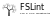

<div align="center">
  
</div>

FSLint is a comprehensive linting and validation tool for Functional Mock-up Units (FMUs) and System Structure and Parameterization (SSP) files. It ensures that your models comply with the [FMI](https://fmi-standard.org/) (1.0, 2.0, 3.0) and [SSP](https://ssp-standard.org/) (1.0, 2.0) standards, checking for both structural correctness and semantic validity.

## Features

- **FMI Validation**: Structural and semantic validation for FMI 1.0.x, 2.0.x and 3.0.x.
- **SSP Validation**: Structural validation for SSP 1.0 and 2.0.
- **Recursive Validation**: Automatically discovers and recursively validates nested FMUs and SSPs within the `resources/` directory.
- **Detailed Reporting**: Generates a validation "Certificate" with hierarchical reporting for nested components.
- **Cross-Platform**: Support for Linux, Windows, and macOS.

## Getting Started

### Prerequisites

- C++23 compatible compiler (e.g., GCC 13+, Clang 16+, MSVC 2022+)
- CMake 3.15 or higher

### Building from Source

```bash
mkdir build
cd build
cmake ..
cmake --build . -j
```

After building, the `FSLint-cli` executable will be located in the `build/` directory.

### Web Interface

FSLint can also be built as a WebAssembly-powered web application:

```bash
# Requires Emscripten and Node.js
python scripts/build_web.py
```

To run the web interface locally after building:

```bash
cd web
npm run dev
```

### Running Tests

To run the test suite, use `ctest` from the `build/` directory:

```bash
cd build
ctest --output-on-failure
```

### Usage

Run the `FSLint-cli` tool from the `build` directory on an FMU file, an SSP file, or an extracted directory:

```bash
./build/FSLint-cli path/to/your_model.fmu
```

### Certificate Management

FSLint can manage validation certificates embedded within the models:

- `-s, --save`: Validate and add a certificate to the FMU/SSP.
- `-u, --update`: Re-validate and update the certificate in the FMU/SSP.
- `-r, --remove`: Remove the certificate from the FMU/SSP.
- `-d, --display`: Display the certificate information from the FMU/SSP.
- `-c, --verify`: Verify the embedded certificate in the FMU/SSP (checks hash integrity and tool version support).
- `-t, --tree`: Display the internal file structure of the FMU/SSP.

Example output:
```text
╔════════════════════════════════════════════════════════════╗
║ MODEL VALIDATION REPORT                                    ║
╚════════════════════════════════════════════════════════════╝
Tool:       FSLint 0.0.1
Timestamp:  2026-02-01 17:22:28 UTC
Model Name: model.fmu
SHA256:     0ad0a8b1ac49c7808aad524b171c1534c3ace783cdc1f2681dd13b0b54b8e889

┌────────────────────────────────────────┐
│ ARCHIVE VALIDATION                     │
└────────────────────────────────────────┘

  [✓ PASS] File Extension Check
  [✓ PASS] Disk Spanning Check
  [✓ PASS] Compression Method Check

...

╔════════════════════════════════════════════════════════════╗
║  MODEL VALIDATION PASSED                                   ║
╚════════════════════════════════════════════════════════════╝
```

## Standard Compliance

FSLint aims for full compliance with the following standards. For a detailed list of all checked rules, see [RULES.md](RULES.md).

- **FMI (Functional Mock-up Interface)**:
  - Version 1.0.x (1.0.0 and 1.0.1).
  - Version 2.0.x (2.0.0 through 2.0.5).
  - Version 3.0.x (3.0.0 through 3.0.2).
- **SSP (System Structure and Parameterization)**:
  - Version 1.0.
  - Version 2.0.

## Project Structure

- `cli/`: Command-line interface implementation.
- `core/`: Core logic for model extraction and validation.
  - `checker/`: Individual validation engines for FMI and SSP.
- `standard/`: XSD schema files for FMI and SSP standards.
- `scripts/`: Utility scripts for development and CI (e.g., encoding checks).
- `images/`: Documentation assets and banners.
- `tests/`: Comprehensive test suite and test data.

## Contributing

Contributions are welcome! See the [CONTRIBUTING](CONTRIBUTING.md) file for details.

## License

This project is licensed under the MIT License - see the [LICENSE](LICENSE) file for details.
